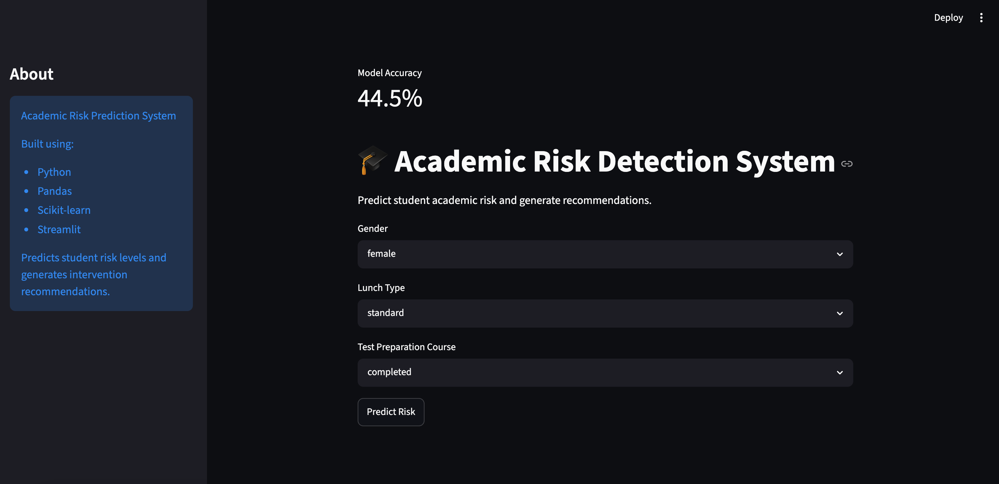
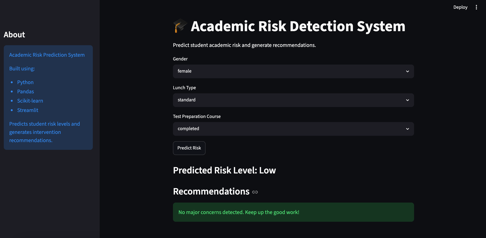
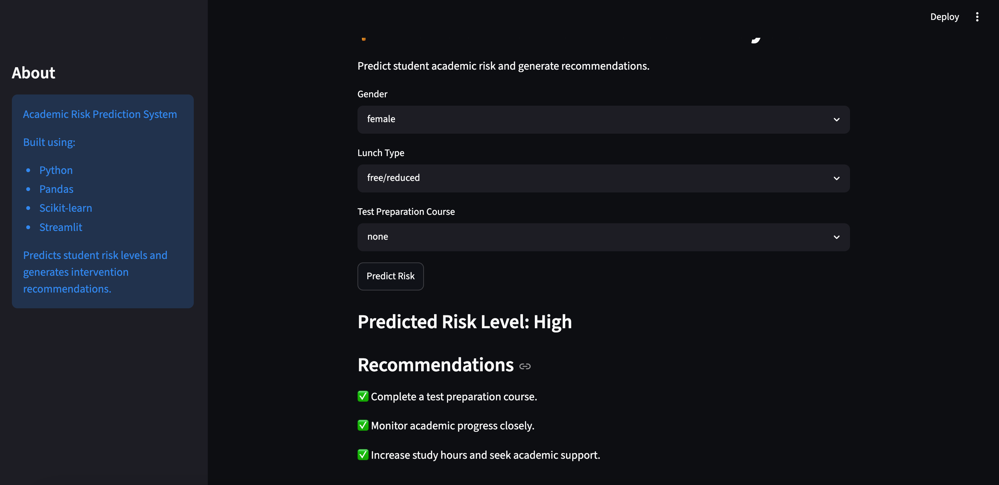
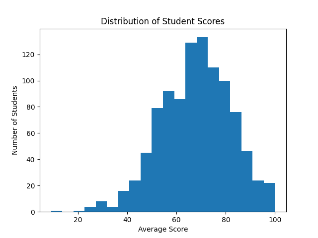
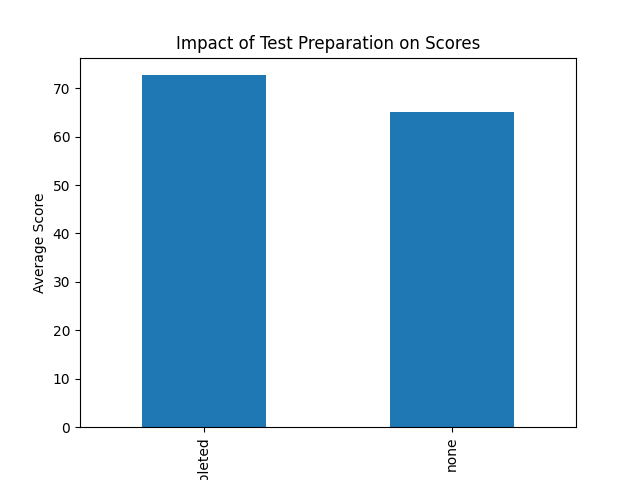
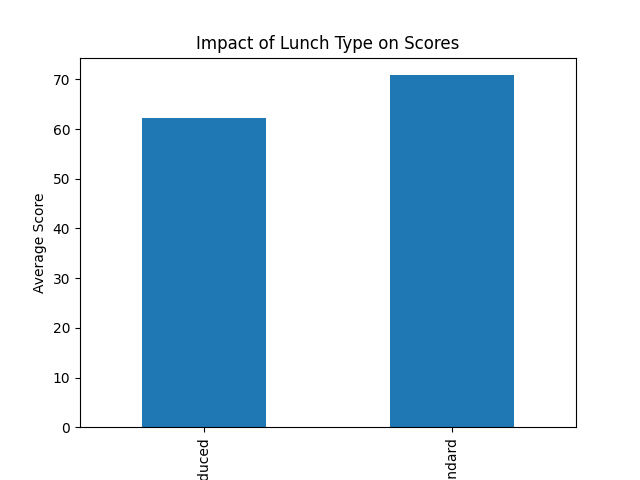
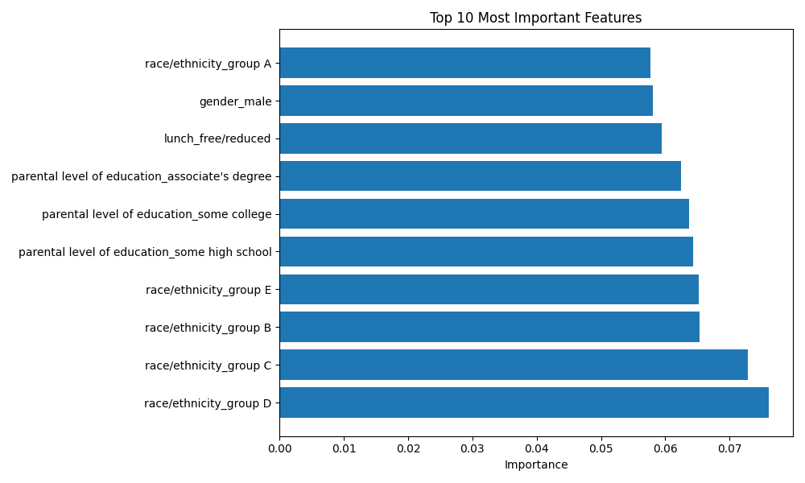

# Academic Risk Prediction System

## Overview

The Academic Risk Prediction System is a machine learning project designed to identify students who may be at risk of academic underperformance based on demographic and educational indicators.

The system analyzes factors such as parental education level, lunch type, gender, race/ethnicity, and test preparation status to classify students into High Risk, Medium Risk, and Low Risk categories. It also generates personalized recommendations to support student success.

An interactive Streamlit dashboard was developed to make predictions accessible through a user-friendly interface.

---

## Dataset

**Dataset:** Students Performance in Exams (Kaggle)

**Records:** 1000 Students

### Features

* Gender
* Race/Ethnicity
* Parental Level of Education
* Lunch Type
* Test Preparation Course
* Math Score
* Reading Score
* Writing Score

---

## Project Architecture

```text
Student Data
      ↓
Data Preprocessing
      ↓
Feature Engineering
      ↓
Risk Level Generation
      ↓
Random Forest Classification
      ↓
Feature Importance Analysis
      ↓
Recommendation Engine
      ↓
Streamlit Dashboard
```

---

## Methodology

### 1. Data Preprocessing

* Loaded and explored the dataset using Pandas.
* Checked for missing values and data inconsistencies.
* Generated derived features for analysis.

### 2. Exploratory Data Analysis (EDA)

* Analyzed score distributions.
* Studied the impact of test preparation courses.
* Compared academic performance across lunch categories.
* Investigated relationships between demographic variables and academic outcomes.

### 3. Feature Engineering

Created academic risk labels using average score thresholds:

| Average Score | Risk Level  |
| ------------- | ----------- |
| 80 and above  | Low Risk    |
| 60 – 79       | Medium Risk |
| Below 60      | High Risk   |

Categorical variables were converted into machine-readable features using One-Hot Encoding.

### 4. Machine Learning Model

* Algorithm: Random Forest Classifier
* Train-Test Split: 80-20
* Model Evaluation: Accuracy Score and Confusion Matrix

### 5. Recommendation Engine

Generated personalized recommendations based on predicted student risk levels and educational indicators.

---

## Results

### Key Findings

* Students who completed a test preparation course scored significantly higher on average.
* Students with standard lunch showed better academic performance than students receiving free/reduced lunch.
* Parental education emerged as one of the strongest predictors of academic performance.
* Lunch type and educational background demonstrated measurable influence on student outcomes.

### Model Performance

#### Experiment 1

Using academic scores as input features:

* Accuracy: **97.5%**
* Observation: High accuracy caused by target leakage because risk labels were derived directly from academic scores.

#### Experiment 2

Using demographic and educational indicators only:

* Accuracy: **44.5%**
* Observation: More realistic prediction scenario because exam scores are not available beforehand.

---

## Technologies Used

* Python
* Pandas
* NumPy
* Matplotlib
* Scikit-learn
* Streamlit
* Git
* GitHub

---

## Application Screenshots

### Home Page



### Low Risk Prediction



### High Risk Prediction



---

## Data Analysis & Insights

### Score Distribution



### Test Preparation Impact



### Lunch Type Impact



### Feature Importance Analysis



---

## Limitations

* Risk labels were generated using score-based thresholds and serve as a proxy for academic risk.
* The Streamlit application currently uses a rule-based demonstration interface.
* Demographic and educational indicators alone are insufficient for highly accurate academic prediction.

---

## Future Improvements

* Integrate the trained Random Forest model directly into the Streamlit application.
* Deploy the application using Streamlit Community Cloud.
* Perform hyperparameter optimization.
* Add explainable AI techniques for prediction transparency.
* Incorporate additional educational and behavioral datasets.

---

## Project Highlights

* Built an end-to-end machine learning workflow.
* Performed exploratory data analysis and feature engineering.
* Developed a Random Forest classification model.
* Analyzed feature importance for model interpretability.
* Created a recommendation engine for student intervention.
* Designed and deployed an interactive Streamlit dashboard.
